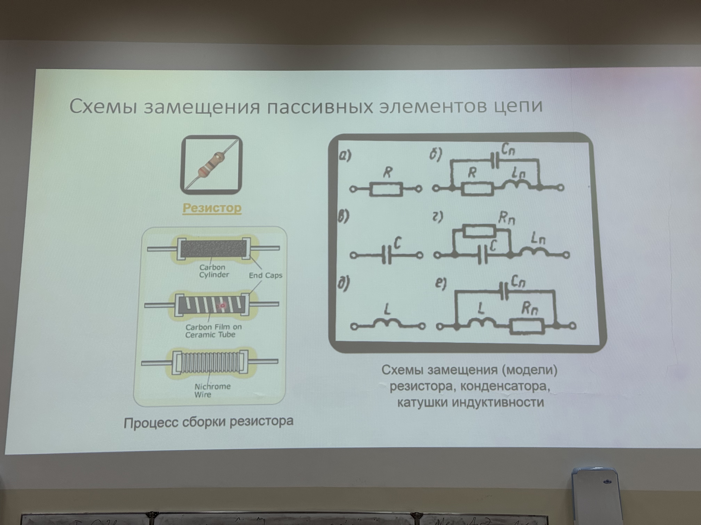
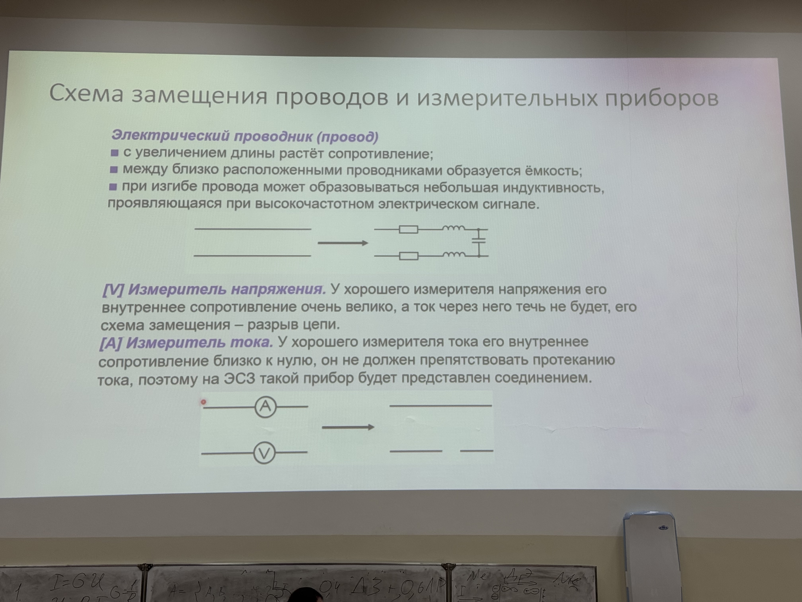
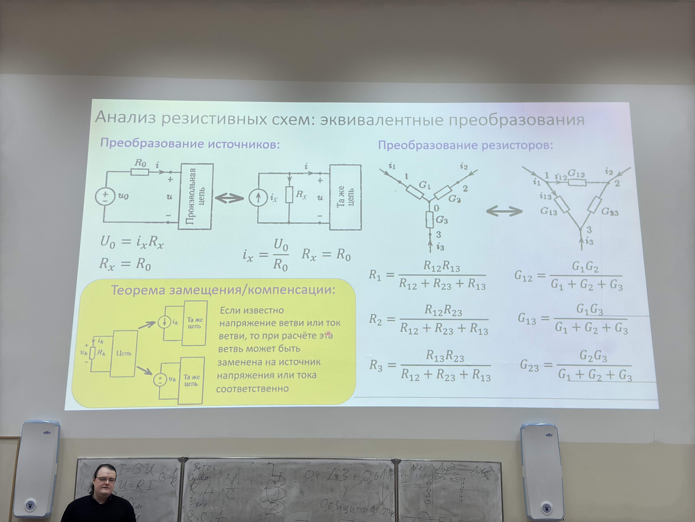
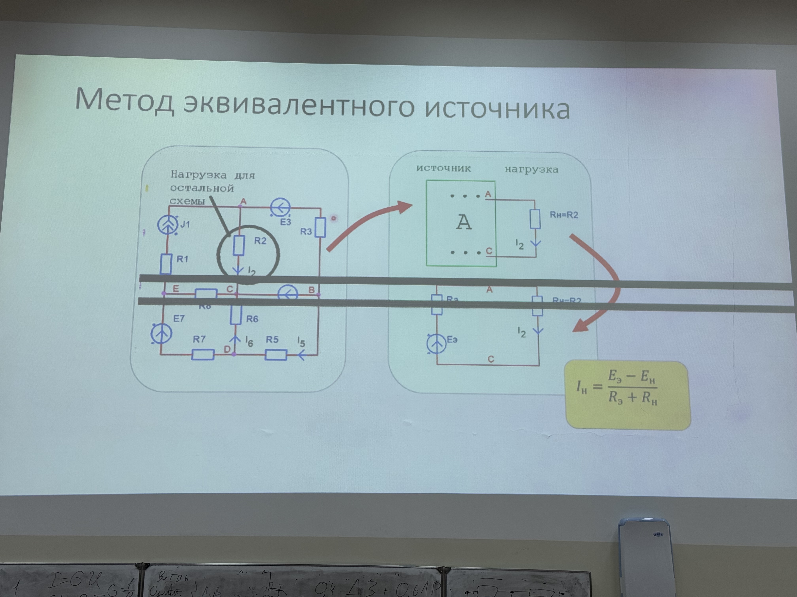
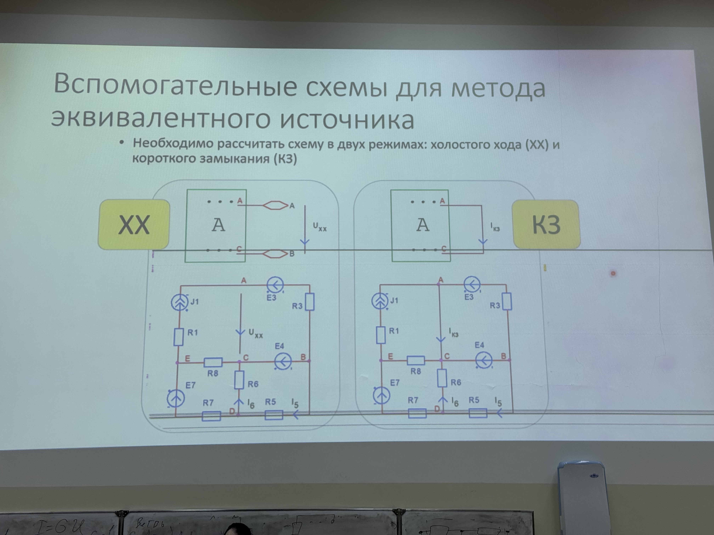
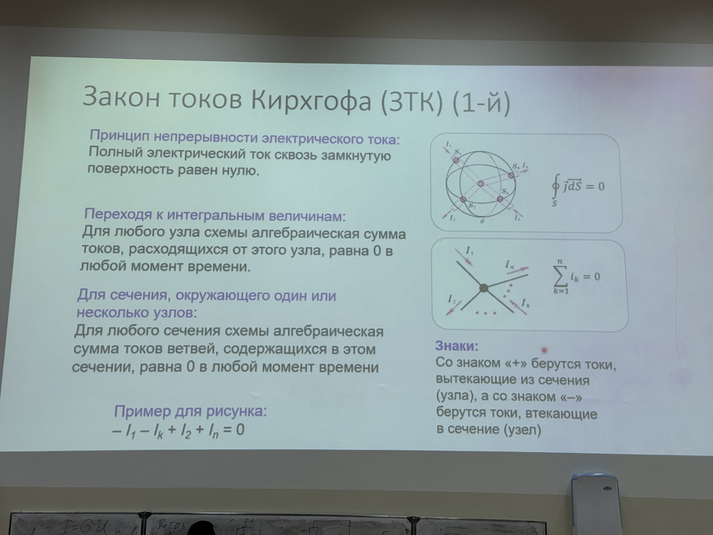

# Элтех
# Спойлер
Дальше будет небольшой колхоз, так как с лекций не всегда понятно прямо все. Как раз из-за этого и стоит ходить на семы, хоть они и не оцениваются. А так вся инфа есть в презах, а презы в [лмс.](https://edu.hse.ru/course/view.php?id=226064)
# Лекция 1
## Формула
0.4 * ДЗ + 0.6 * Лабы(0.6 Защита, 0.4 Отчет)

На ДЗ примерно три недели, каждая неделя просрочки - минус один балл

У каждой подгруппы должно быть 6 практосов, лабы всего 4. Отчеты хардово будут сдаваться где-то с конца февраля.

Защита - решение коротких задач и ответ на контрольные вопросы

**Экзамена нет**, итоговая оценка равна накопу.

## Что изучает элтех
Элтех изучает **электромагнитные явления, происходящие в электромагнитных цепях.**

Состоит из двух разделов: теория электромагнитного поля и теория электрических цепей. В основном будет изучаться именно теория электрических цепей.

## Простейшие эл. взаимодействия и их модели
1. Перенос заряда в проводнике
$$
J = \frac{ne^2\overline{\lambda}}{2m\overline{v}}E \rightarrow J = \sigma E \newline
I = GU \text{ - закон Ома через проводимость}
$$

Тип элемента - резистивный (резистор)

2. Поляризация в диэлектрике
$$
\int Edx = \int \frac{1}{S\epsilon_0\epsilon_a}qdx \rightarrow U = q \frac{d}{S\epsilon_0\epsilon_a} = \frac{q}{C} \rightarrow U = \frac{1}{C}\int idt \text{ - поле плоского конденсатора}
$$
Тип элемента - емкостной (конденсатор).

3. Самоиндукция в соленоиде
$$
E = -\frac{d\psi}{dt} = - \frac{\frac{di \mu \mu_0 N^2 S}{l}}{dt} = -\frac{diL}{dt} \rightarrow E = -L\frac{di}{dt} \text{ - ЭДС самоиндукции}
$$

Тип элемента - индуктивный.

## Схема замещения пассивных элементов цепи

> Пассивные элементы - потребители энергии. 

Резистор по факту включает в себя все три типа элемента.

## Схемы замещения активных компонентов цепи

> Активные элементы - те, которые создают электрическую мощность. В нашем случае это **источник напряжения и источник тока**.

> Идеальные источники - те, которые выдают одинаковую мощность вне зависимости от нагрузки. Чтобы привести их к реальным, мы подключаем к ним сопротивление (последовательное или параллельное), чтобы создать аналог внутреннего сопротивления.

## Схемы замещения проводов и измерительных приборов

## Классификация электрических цепей
1. Линейные/нелинейные.
Линейные имеют какую-то линейную зависимость, которой их можно охарактеризовать. У нелинейных такие зависимости чаще всего экспоненциальные, и для них рассчитывать эту зависимость нужно в каждой точке.
2. С сосредоточенными/распределенными параметрами. 

## Основные понятия геометрии цепей

> Ветвь - участок цкепи, на котором компоненты располагаются последовательно. $R, L, \overline{C}$ суммируются.

> Узел - место соединения трех и более ветвей. $G = \frac{1}{R}, C, \frac{1}{L}$ суммируются.

> Контур - замкнутая последовательность ветвей цепи.

> Путь - непрерывная последовательность ветвей, связывающая несколько узлов.

## Эквивалентные преобразования резистивных цепей

## Метод эквивалентного источника

### Вспомогательные методы

Холостой ход - это когда источник тока работает "в никуда".

## Закон токов Киргхофа

Помогите, я нихуя не понимаю.......

